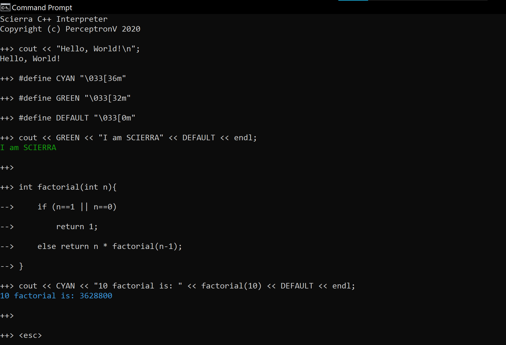

# Scierra

Scierra [_see-eh-rah_] is a **S**imulated **C**++ **I**nt**er**preter with **R**ecurrent **A**daptation.

In human words, it's a interactive interpreter for C++, which allows you to run and debug your program immediately as you type. Well, basically. But the implementation is slightly trickier.

To get a quick start, simply launch Scierra on the terminal and type `cout << "Hello, World!";`. Yes. That's a complete program in Scierra.

* [Example](#Example)

* [Installation](#Installation)

    * [Prerequisites](#Prerequisites)

    * [Install with PIP](#Install-with-PIP)

* [Usage](#Usage)

   * [Basic](#Basic)
   
   * [Keywords](#Keywords)

## Example

## Installation

### Prerequisites:

* _Python_ must be **installed** and **added to PATH**.
   
   The key ideas of Scierra and it's CLI have been implemented in Python.

* _GCC_ (GNU Compiler Collection) must be **installed** and **added to PATH**.
   
   This allows Python to access G++ through the command line. If you're a Linux user, there's a good chance that GCC tools are already included in your distro. Users of other operating systems like Windows or MacOS may need to make additional installations. A MinGW installation has been tested to work with Scierra on Windows.

### Install with PIP

Install with PIP using:

    $ pip install scierra

or (for LINUX users):

  
After installation, run Scierra on your terminal using:

    $ scierra

## Usage

### Basic

Launch `scierra` in your terminal, 

### Keywords

* `<print>`

* `<restart>`

* `<esc>`

* Code keywords

   * `<`
   
   * `<prep>`
   
   * `<glob>`

## LICENSE
[Apache License 2.0](LICENSE)
